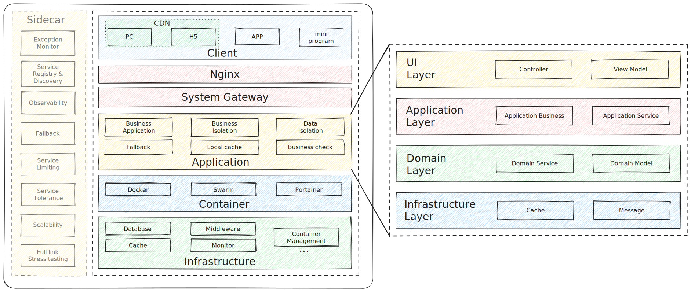

# SecKiller

SecKiller, a classic flash sale system built in Java, meets features such as high concurrence, high performance and high availability, observability, forewarnability, scalability.

In order to meet the million degree of concurrency and high recognition, SecKiller adopts mainstream technical framework as follows:

| Technical Type                                  | Framework             |
|-------------------------------------------------|-----------------------|
| Develop framework                               | SpringBoot            |
| Cache                                           | Redis & local cache   |
| Database                                        | PostgreSQL            |
| Business Gateway                                | SpringCloud Gateway   |
| Persistence framework                           | MyBatis               |
| Service configuration  & registry discovery | Nacos                 |
| Container                                       | Docker                |
| Contain Management                              | Swarm, Portainer      |
| Monitor & Observability                         | Prometheus, Grafana   |
| System Limiting                                 | Nginx & Lua, Sentinel |
| Middleware                                      | RocketMQ              |
| Unit testing                                    | JUnit                 |
| Stress testing                                  | JMeter                |

## Purpose

The same as mostly other large systems, purposes of SecKiller could be divided into 3 sections:

- Consumer - fluency, API stability, data certainty, non-blank pages;
- Business - data correct, funds safety, price isolation, pipe isolation;
- Platform - Consume & Business assurance, service isolation, data isolation.

From a directly technical point of view, SecKiller needs to meet 10w+ QPS of page accesses, 1w+ TPS of service.

Alternatively, there are many other challenges SecKiller will face, such as 
**Huge instantaneous traffic**, **Hot data**, **Inventory oversold**, **Brush traffic**
...

## Architecture

SecKiller adopts special layered design for flash sale.In addition, the Application layer as the code layer of business service adopts DDD design philosophy, which is a software engineering approach to solving a specific domain model.

## Feature

.

## License

The code of the SecKiller project follows [Apache License 2.0](LICENSE).
